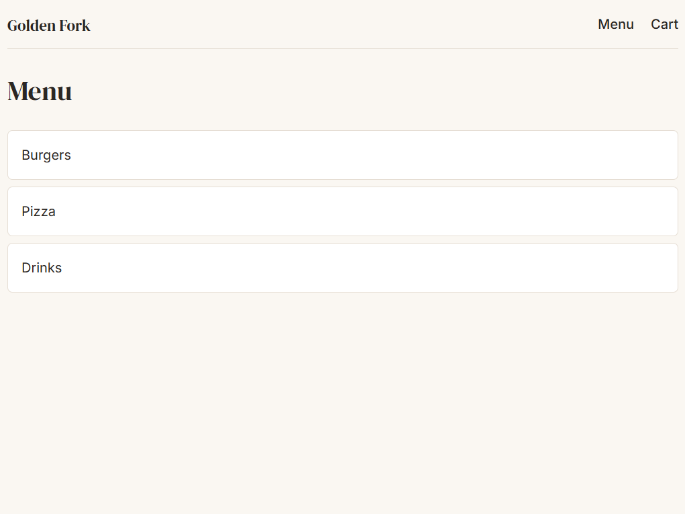
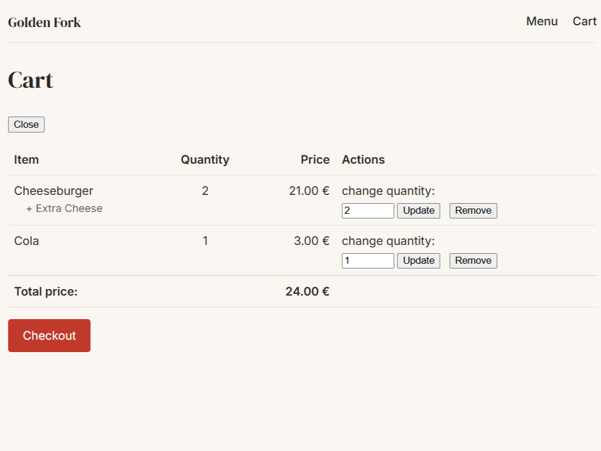
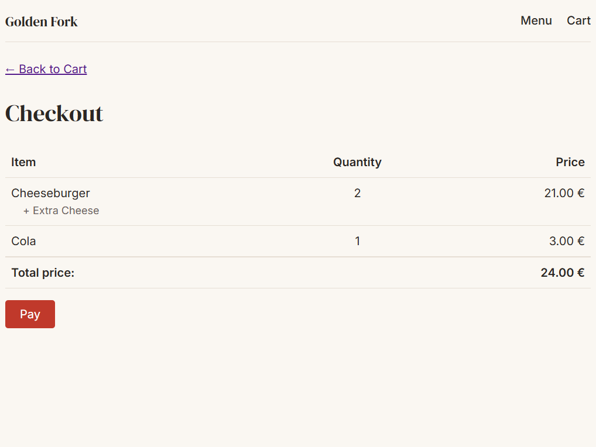
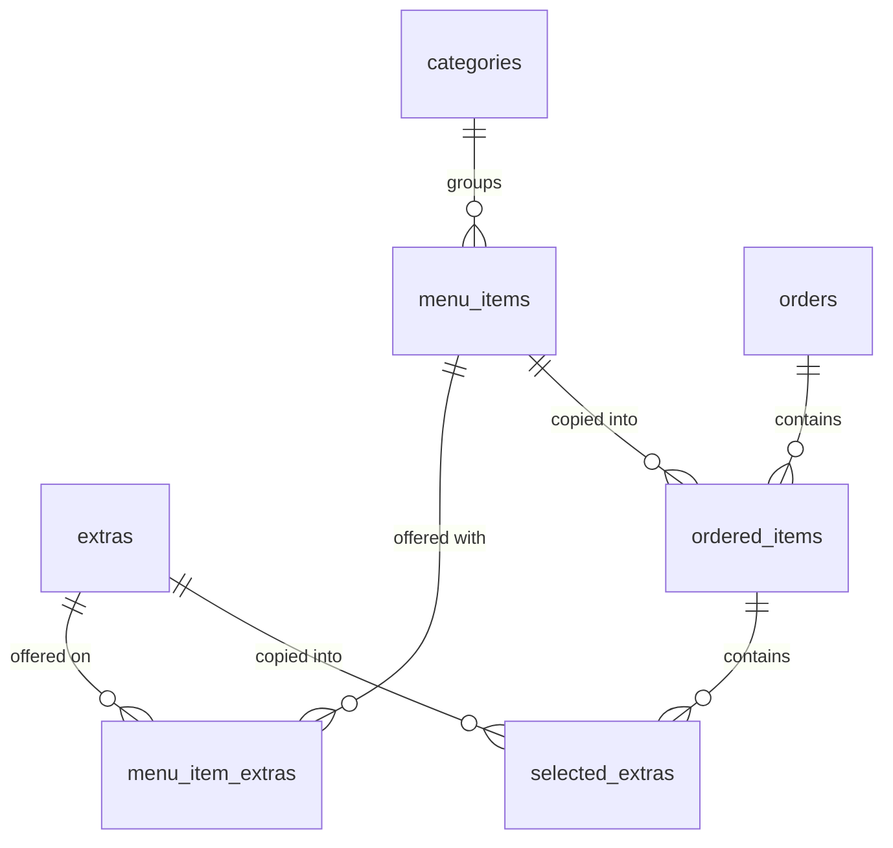

# Golden Fork — Restaurant Ordering System

A full-stack restaurant ordering application built with Java 21 and Spring Boot. Customers browse a menu, build a cart, and pay by card through Stripe. Staff manage the menu and work a live kitchen queue.

Built solo over ~8 weeks as the capstone project of a Java backend apprenticeship, shipped incrementally across weekly sprints.

**▶️ [Watch the 1-minute demo](https://youtu.be/BloftlyhFDU)**

---

## Screenshots

| Menu                               | Cart                               | Checkout                                   |
|------------------------------------|------------------------------------|--------------------------------------------|
|  |  |  |

---

## What it does

**For customers**
- Browse the menu: categories → items → optional extras
- Build a cart, change quantities, remove items, see a running total
- Pay by card via Stripe Checkout
- Receive an HTML receipt by email

**For staff**
- Full CRUD on categories, menu items and extras, protected by role
- A kitchen queue of paid, unfulfilled orders, sorted by payment time
- Mark an order fulfilled
- A manual cash-payment override that bypasses Stripe

The app serves **two front ends from one codebase**: a REST API for programmatic clients, and server-rendered Thymeleaf pages for the browser. Both call the same service layer — no logic is duplicated.

---

## Tech stack

|           |                                                           |
|-----------|-----------------------------------------------------------|
| Language  | Java 21                                                   |
| Framework | Spring Boot 4.1 — Web MVC, Data JPA, Security, Validation |
| Database  | PostgreSQL + Hibernate                                    |
| Views     | Thymeleaf (server-side rendering)                         |
| Payments  | Stripe Checkout + webhooks (`stripe-java`)                |
| Email     | Spring Mail / SMTP                                        |
| Testing   | JUnit 5, Mockito, MockMvc, `spring-security-test`         |
| Build     | Maven                                                     |

---

## Domain model



Two halves that meet only through a copy.

**`categories` → `menu_items` → `extras` is the live menu**, which an admin edits. Nothing is ever deleted here; an `is_active` flag hides a record instead, so past orders referencing it stay readable.

**`orders` → `ordered_items` → `selected_extras` is a placed order** — a frozen copy of what the customer actually bought. The links back to the menu record only *which* product it was. The money lives on the order side, so changing a menu price never rewrites an order.

📋 **[Full schema with every column →](docs/DATABASE.md)** · defined in [`schema.sql`](src/main/resources/schema.sql)

---

## Design decisions worth explaining

These are the choices I would defend in a code review.

### Prices are snapshotted, not referenced

`OrderedItem` and `SelectedExtra` store their own `price_at_purchase`. They do not read the current price off `MenuItem`.

If an admin raises the price of a burger, every order already placed keeps the price the customer agreed to. Referencing the live price would silently rewrite history — including orders Stripe has already charged.

All money is `BigDecimal`, compared with `.compareTo()` and never `.equals()`, because `2.50` and `2.5` are equal in value but not equal objects.

### A payment is confirmed two independent ways

Stripe notifies the app by webhook. Webhooks get lost.

I found this by running a checkout with the webhook listener switched off: Stripe still charged the card, but the order stayed unpaid forever — and a retry then hit the "session already complete" branch, making the order **permanently unpayable and unpaid**. The customer's money was gone and the system did not know.

The fix was a second, independent path. When the browser lands on `/checkout/success`, the app asks Stripe directly whether that session was paid, and settles the order if so. The webhook is still the primary route. Either path alone is now enough, and both landing together is harmless.

### A failed receipt email can never un-pay an order

`payOrder` is `@Transactional`. If the mail server is down and a `MailException` escapes, Spring rolls the transaction back — reverting an order that Stripe has already charged.

So `ReceiptService` catches its own failures and logs them. A lost email is a support ticket. A rolled-back payment is a chargeback.

### The session holds only the cart's id, never the cart

The cart *is* an `Order` row. The HTTP session stores only its id, and cart routes are `GET /cart`, never `/cart/{id}`.

The moment an id can arrive in the URL, the session is decoration and anyone can edit a stranger's cart. Keeping the id server-side is what makes the route safe. The row is also created lazily, on the first item added — otherwise every crawler hit would write an empty order.

### Secrets have no default, on purpose

Configuration is read from environment variables. Non-sensitive keys have sensible fallbacks; five keys (`DB_PASSWORD`, `MAIL_USERNAME`, `MAIL_PASSWORD`, `STRIPE_API_KEY`, `STRIPE_WEBHOOK_SECRET`) have none, so the app refuses to start when they are missing.

A wrong value that boots is worse than no value that fails. A defaulted Stripe key would start happily and only break at the moment a customer tries to pay.

### Two limits, not one

An order total above `99999.99` overflowed the database column and became a raw 500. A per-line quantity cap of 100 was the obvious fix — and it was not enough, because the total is a sum across lines, so two lines of 100 still overflow.

There are now two independent rules: a per-line cap that explains itself to the customer, and a cap on the order total that is the actual safety net. Removing items is deliberately left unguarded, so a customer with an over-limit cart can always shrink it.

---

## Running it locally

### Prerequisites

- Java 21
- PostgreSQL running locally
- A [Stripe test account](https://dashboard.stripe.com/register) (free — test keys cannot move real money)
- Optional: [MailHog](https://github.com/mailhog/MailHog) for catching receipt emails locally

### 1. Create the database

```bash
createdb restaurant
```

Tables are created automatically on first start from `schema.sql` plus Hibernate.

### 2. Add your secrets

`src/main/resources/application.properties` is committed and holds only `${VARIABLE:default}` placeholders. Real values go in `config/application.properties` at the repo root, which is gitignored. Spring Boot merges an external `config/` directory over the packaged one, key by key.

Create `config/application.properties`:

```properties
DB_PASSWORD=your_postgres_password

STRIPE_API_KEY=sk_test_...
STRIPE_WEBHOOK_SECRET=whsec_...

# MailHog needs no credentials, but the keys must exist
MAIL_USERNAME=
MAIL_PASSWORD=
```

### 3. Run

```bash
./mvnw spring-boot:run
```

The app starts on <http://localhost:8080> and seeds an admin user: **`admin` / `admin123`**.

### 4. Forward Stripe webhooks

In a second terminal:

```bash
stripe listen --forward-to localhost:8080/api/webhook/payment
```

Use the `whsec_...` it prints as your `STRIPE_WEBHOOK_SECRET`. Pay with Stripe's test card `4242 4242 4242 4242`, any future expiry, any CVC.

### 5. Add some menu items

Nothing to do — [`data.sql`](src/main/resources/data.sql) seeds a demo menu on first start: three categories, four items and three extras.

It is written to be safe to re-run. Every statement is an `INSERT ... SELECT ... WHERE NOT EXISTS`, so restarting the app never duplicates the menu.

To add your own, use the admin API:

```bash
curl -u admin:admin123 -X POST http://localhost:8080/api/menuItems \
  -H "Content-Type: application/json" \
  -d '{"name":"Veggie Burger","description":"Grilled halloumi and roasted pepper","price":9.00,"imageUrl":"/images/placeholder.svg","isActive":true,"categoryId":1}'
```

Then visit <http://localhost:8080>.

---

## API reference

Public endpoints are open. Everything marked 🔒 requires HTTP Basic auth as an admin.

### Browsing

| Method | Path                         | Description               |
|--------|------------------------------|---------------------------|
| `GET`  | `/api/categories`            | Active categories         |
| `GET`  | `/api/categories/{id}`       | One active category       |
| `GET`  | `/api/menuItems/{id}`        | One active menu item      |
| `GET`  | `/api/menuItems/{id}/extras` | Active extras for an item |

### Cart and orders

| Method   | Path                                                       | Description             |
|----------|------------------------------------------------------------|-------------------------|
| `GET`    | `/api/orders/{id}`                                         | An order with its total |
| `POST`   | `/api/orders/{id}/items`                                   | Add an item             |
| `PUT`    | `/api/orders/{id}/items/{itemId}`                          | Change quantity         |
| `DELETE` | `/api/orders/{id}/items/{itemId}`                          | Remove an item          |
| `POST`   | `/api/orders/{id}/items/{itemId}/extras/{extraId}`         | Add an extra            |
| `DELETE` | `/api/orders/{id}/items/{itemId}/extras/{selectedExtraId}` | Remove an extra         |

### Payment

| Method | Path                           | Description                                               |
|--------|--------------------------------|-----------------------------------------------------------|
| `POST` | `/api/payment/{orderId}`       | Start a Stripe Checkout session, returns the redirect URL |
| `POST` | `/api/webhook/payment`         | Stripe webhook receiver (signature verified)              |
| `POST` | `/api/orders/{orderId}/pay` 🔒 | Manual cash override, bypasses Stripe                     |

### Admin

| Method                | Path                                                  | Description                                    |
|-----------------------|-------------------------------------------------------|------------------------------------------------|
| `POST` `PUT` `DELETE` | `/api/categories`, `/api/menuItems`, `/api/extras` 🔒 | Menu CRUD (soft delete)                        |
| `GET`                 | `/api/{resource}/all` 🔒                              | Includes inactive records                      |
| `GET`                 | `/api/orders/kitchen` 🔒                              | Paid, unfulfilled orders, oldest payment first |
| `PUT`                 | `/api/orders/{id}/fulfill` 🔒                         | Mark an order served                           |

### Pages

`/` · `/menu` · `/menu/categories/{id}` · `/menu/items/{id}` · `/cart` · `/checkout` · `/checkout/success` · `/checkout/failure`

---

## Testing

```bash
./mvnw test
```

**218 tests**, across 15 test classes.

- Services are unit tested with Mockito.
- Controllers — REST and page — run under `@SpringBootTest` with MockMvc, against a real PostgreSQL database.
- Page controller tests render the actual Thymeleaf templates, so a broken expression or a missing fragment fails the build.

Tests run against a **separate `restaurant_test` database**, configured by a self-contained `src/test/resources/application.properties` that is deliberately committed. It is a complete config rather than a profile overlay, because the textbook overlay approach needs a base file to merge onto — and on a build server there is nothing underneath.

Mail is pointed at `localhost:1025` with 1-second timeouts, so test runs cannot send real email.

---

## Known gaps and what's next

Tracked as GitHub issues. Listed here because knowing what is missing is part of the work.

- **Customers are still anonymous.** An `Order` holds a plain email string with no `User` relation, and order ids are sequential. Anyone who guesses an id can read or modify that order. The next feature is a real customer account system.
- **Docker and CI.** Environment-based configuration is done. A Dockerfile, Compose setup and a GitHub Actions pipeline are the next two issues.
- **Duplicate receipts are possible.** If the webhook and the redirect both land, both send a receipt. Known and deliberately shipped as-is.
- **Page errors render as plain text.** The global exception handler is `@RestControllerAdvice` and applies to page controllers too, so a bad id gives a bare 404 body instead of a styled error page.
- **Extras cannot be linked to menu items through the API.** The join is writable only by SQL — the association half of admin CRUD is missing.

---

## Author

**Mohammad Ameen** — Java backend developer

- 💼 [LinkedIn](https://www.linkedin.com/in/mohammad-ameen-kanaan-763564230/)
- ▶️ [Project demo video](https://youtu.be/BloftlyhFDU)


> The restaurant, its address and its contact details are fictional placeholders.
