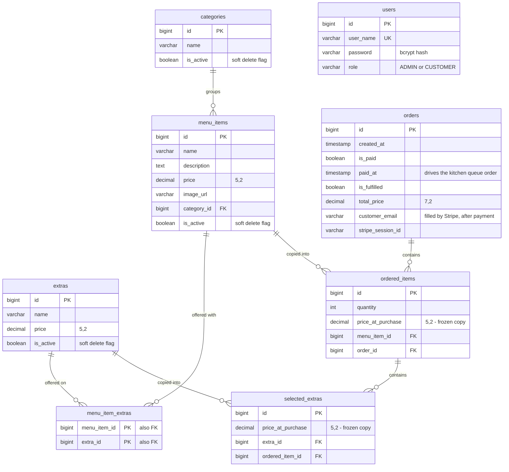

# Database schema

Full entity-relationship diagram for the Golden Fork ordering system. The authoritative definition is [`schema.sql`](../src/main/resources/schema.sql); this page is the readable version of it.

For the short version and the reasoning behind the design, see the [README](../README.md).

## The live menu

`categories` → `menu_items` → `extras`. This is what an admin edits.

Nothing here is ever deleted. `is_active` hides a record instead, so orders that reference it stay readable — a hard delete would break the foreign keys of every past order containing that item.

`menu_item_extras` is a plain join table with a composite primary key of the two foreign keys. One extra (Bacon) can belong to many items, and one item can offer many extras.

**Ownership note:** in JPA, `Extra` owns this relationship and `MenuItem.extras` is `mappedBy = "menuItems"`. Setting the collection from the `MenuItem` side persists nothing — the link has to be written through the `Extra`.

## A placed order

`orders` → `ordered_items` → `selected_extras`. This is a frozen copy of what a customer actually bought.

The foreign keys back to `menu_items` and `extras` record only *which* product this was. The money lives in `price_at_purchase` on the order side. When an admin changes a menu price, past orders are untouched.

`ordered_items` and `selected_extras` are managed entirely through `OrderService` by JPA cascade — they have no controllers and no endpoints of their own.

### Column notes

- `orders.paid_at` is separate from `created_at` on purpose. An order created earlier can be paid later, and the kitchen queue serves in payment order, so it sorts on `paid_at`.
- `orders.customer_email` is `NULL` until payment completes. Stripe Checkout collects the email itself, and the webhook reads it back from the session.
- `orders.stripe_session_id` is what makes the missed-webhook recovery possible — without it, the app could not ask Stripe after the fact whether a session was paid.
- `orders.total_price` is `DECIMAL(7,2)`. The application caps an order total at 10000 so this column can never overflow.

## users

`users` has no relationship to any other table.

That is accurate, not an omission. Customers are anonymous: an order holds a loose `customer_email` string with no account behind it, and `users` exists only for admin login. Connecting the two is the next planned feature.
